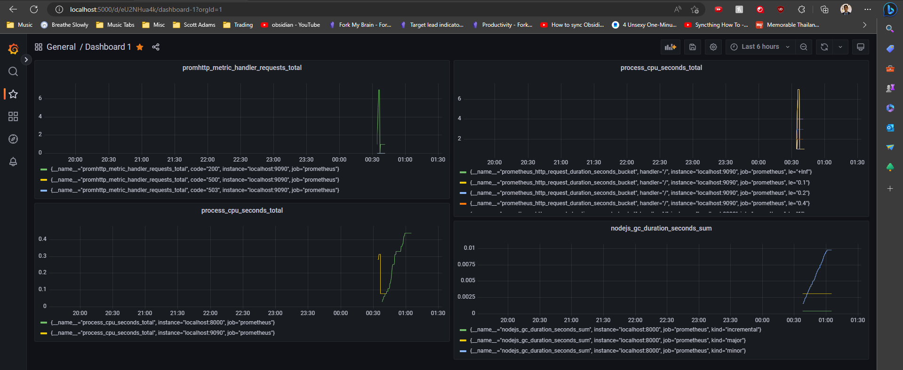
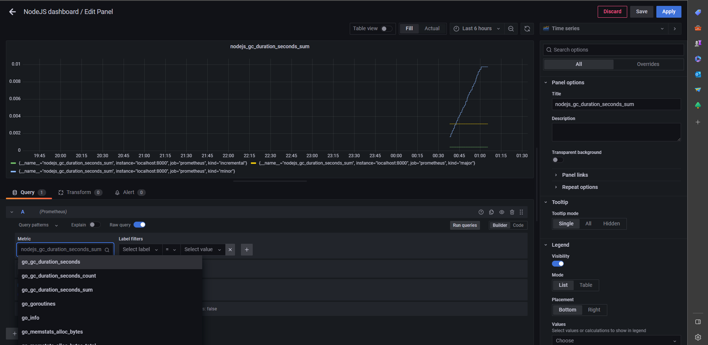

## Node.js server - Prometheus metrics/Grafana

Using Typescript, ES modules, webpack for nodejs/express server. Tracking metrics from prom-client (prometheus) & grafana

## How to setup

- Install webpack, webpack-cli (To run webpack commands in package.json)
- Install typescript, express, cors plugin
- Webpack plugins
  - clean-webpack-plugin (To delete dist folder, start from blank slate)
  - node-polyfill-webpack-plugin (install polyfills required by node)
  - nodemon-webpack-plugin (to run nodemon watcher)
  - ts-loader (compile TS to JS)
  - webpack-node-externals (prevents errors due to node/node_modules?)

## Explanations

- We added a function for starting the metrics server on a different port. (as we don't want to expore that PORT publicly to other users)
- We didn't add type: "module" in package.json
- We told webpack that our target is node, added a loader to convert TS to JS, then used a nodemon plugin to start the live server

## Prometheus/Grafana

- Install grafana on your machine
- By default grafana is accessible on localhost:3000, to change it modify the default.ini file in C:\Program Files\GrafanaLabs\grafana\conf
- Add a datasource as prometheus, specify the URL of your prometheus server (Adding the /metrics of my node server didn't work)
- Install prometheus
- Modify config if needed -> prometheus.yml
- Run the server -> prometheus.exe
  - The terminal will specify the port to open (localhost:9090)
- In grafana, you can add a new dashboard. Then you can add panels for each visualization.
- If you hit /metrics of your nodejs server/prometheus server you can see the current metrics tracked
- Use the metric_name & save and apply the panel

## Future improvements

- Explore custom metrics in prometheus (CPU usage, response time)
- Add other visualizations (gauge, histogram, counter, etc)
- Try migrating grafana/prometheus to Docker.

